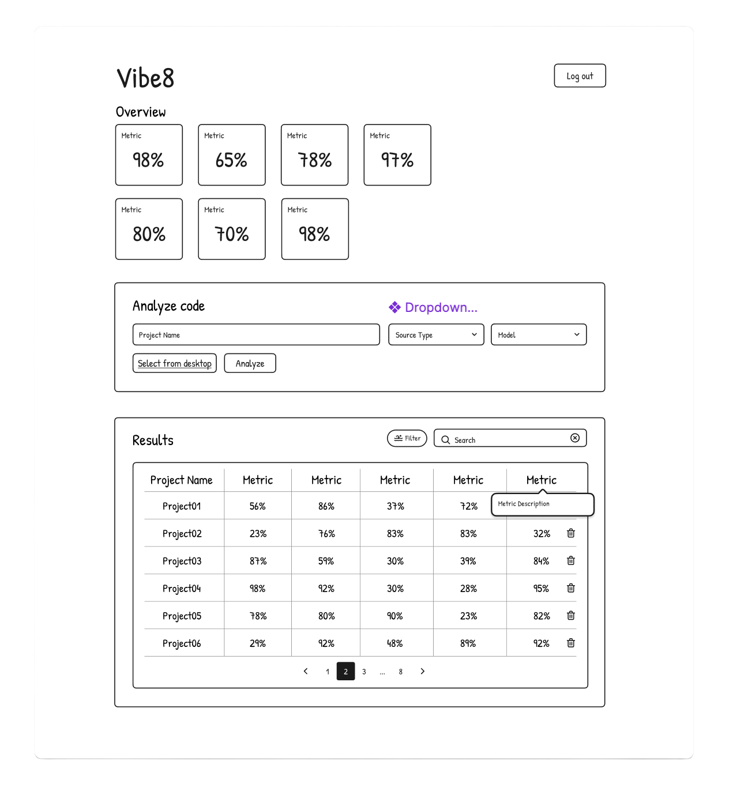
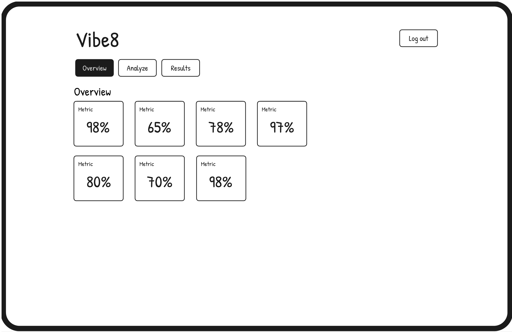
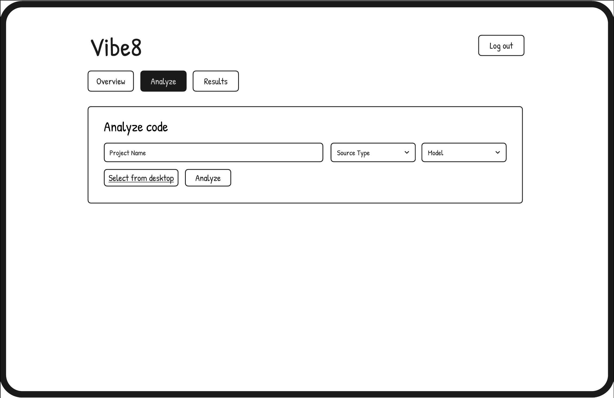
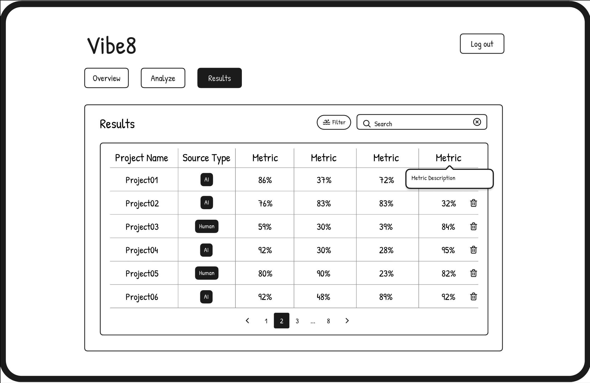

# Wireframes & UI Design

1) **Wireframe snapshots**
- Initial single-page prototype showing overview tiles, analyze form, and results grid in one scroll.
- Iteration into three nav-driven views: `Overview`, `Analyze`, and `Results` with consistent header/log-out treatment.
- Wireframe assets (stored in `docs/wireframes/`):    

2) **Navigation & layout**
- Current app splits flows by top nav pills (see `frontend/components/dashboard/section-nav.tsx`) instead of the original single page, keeping cognitive load low as features grew.
- Header keeps brand “Vibe∞” plus log-out CTA; sections lead with concise intros before content (e.g., overview tiles, analyze form, results table).
- Layout favors generous spacing, pill buttons, and bordered cards to separate flows while staying minimal.

3) **Theming & surfaces**
- Default dark experience with `next-themes` provider and a light-mode toggle available; glassmorphic cards (`GlassmorphicCard`) and translucent pills carry the visual system.
- Color-coded metrics (greens for healthy, amber for risk, rose for security) appear across metric tiles and table cells for quick scanning.
- Input surfaces (forms, pills, badges) use soft borders/shadows to stay readable in both modes.

4) **Interactive components**
- Analyze form supports local files and GitHub repos with async polling, job status badges (`JobStatusIndicator`), and task/model selectors.
- Results table combines search, column sort, pagination, and both basic (source/model) and advanced filters (reliability, complexity, MI, security); rows are clickable to open the file-tree modal for drill-down; destructive actions confirm before delete.
- Dense tooltip system: metric info in tiles (`MetricTooltip`), per-task comparison hovers (`TaskMetricsTooltip`), chart tooltips, and filter helpers. Light/dark toggle and responsiveness keep the same interactions on mobile.

5) **Data visuals & UX polish**
- Animated spider/radar chart, correlation heatmap, and task comparison visuals (all responsive via Recharts containers) give quick human vs AI deltas.
- Metric tiles bundle grouped stats with microcopy; table badges tag source/model at a glance; pagination keeps long runs manageable.
- Smooth modal overlays for file views, consistent card framing, and hover states/tooltips maintain a seamless, low-friction experience.
