# High-level system architecture

## Architecture Diagram

**Legend:**
- **Blue** (Presentation): User-facing components
- **Green** (Application): Business logic and API
- **Orange** (Async): Background job processing
- **Purple** (Domain): Core analysis functionality
- **Teal** (Data): Persistence layer
- **Red** (External): Third-party services

**Data Flow:**
1. User uploads code via frontend or MCP Server (Claude Desktop)
2. API enqueues analysis job to Redis
3. ARQ worker picks up job and executes metrics collection
4. Results stored in PostgreSQL
5. User polls API for completed results

---

# Frontend architecture

**Architecture Layers:**
- 🔵 **Routing** - Next.js 14 App Router pages
- 🟢 **Authentication** - Auth0 OAuth 2.0 (Google + GitHub)
- 🟠 **Features** - Upload, Results, Job Polling
- 🌸 **UI** - Reusable components (shadcn/ui + Radix)
- 🟣 **Services** - API client with JWT authentication
- 🔴 **External** - Auth0 and Backend API

---

# Web Auth Flow (Frontend)

# Device Auth Flow (MCP)

# Code analysis flow

# Backend API endpoints

# Metrics Collection pipeline

# Security Flow

```mermaid
%%{init: {'theme':'base', 'themeVariables': { 'primaryColor':'#E3F2FD','primaryTextColor':'#000','primaryBorderColor':'#1976D2','lineColor':'#1976D2','secondaryColor':'#FFF3E0','tertiaryColor':'#F1F8E9','edgeLabelBackground':'#ffffff','clusterBkg':'#ffffff','clusterBorder':'#1976D2','titleColor':'#000'}}}%%
flowchart TB
   A["API Request"]
   B["CORS Check"]
   C["Rate Limit"]
   D["Email Allowlist"]
   E["JWT Verification"]
   F["Input Validation"]
   G["Owner Check"]
   H["✓ Request Authorized"]

   A --> B
   B --> C
   C --> D
   D --> E
   E --> F
   F --> G
   G --> H

   style A fill:#E3F2FD,stroke:#1976D2,stroke-width:2px,color:#000
   style B fill:#FFF3E0,stroke:#F57C00,stroke-width:2px,color:#000
   style C fill:#FFF3E0,stroke:#F57C00,stroke-width:2px,color:#000
   style D fill:#FFF3E0,stroke:#F57C00,stroke-width:2px,color:#000
   style E fill:#FFF3E0,stroke:#F57C00,stroke-width:2px,color:#000
   style F fill:#FFF3E0,stroke:#F57C00,stroke-width:2px,color:#000
   style G fill:#FFF3E0,stroke:#F57C00,stroke-width:2px,color:#000
   style H fill:#E8F5E9,stroke:#388E3C,stroke-width:2px,color:#000

   linkStyle default stroke:#1976D2,stroke-width:2px
```

**Legend:** 🔵 Blue = Entry Point | 🟠 Orange = Security Checks | 🟢 Green = Authorized

# Async Job Queue Flow

This sequence diagram shows the chronological interactions between all actors in the async job queue system.

# Testing

**Legend:** 🔵 Blue = Trigger | 🟠 Orange = Backend | 🌸 Pink = Frontend | 🟢 Green = Deployment

# Database Schema

# MCP Server Architecture

**MCP Components:**
- **FastMCP Server** - Entry point, registers tools with Claude Desktop
- **Tools Module** - 6 tools: analyze_code, check_job_status, get_job_result, find_analysis, get_file_tree, finish_login
- **HTTP Client** - Makes authenticated requests to Vibe8 API
- **Auth Module** - Handles OAuth Device Flow authentication
- **Token Store** - Persists tokens locally (~/.vibe8/mcp_tokens.json)
